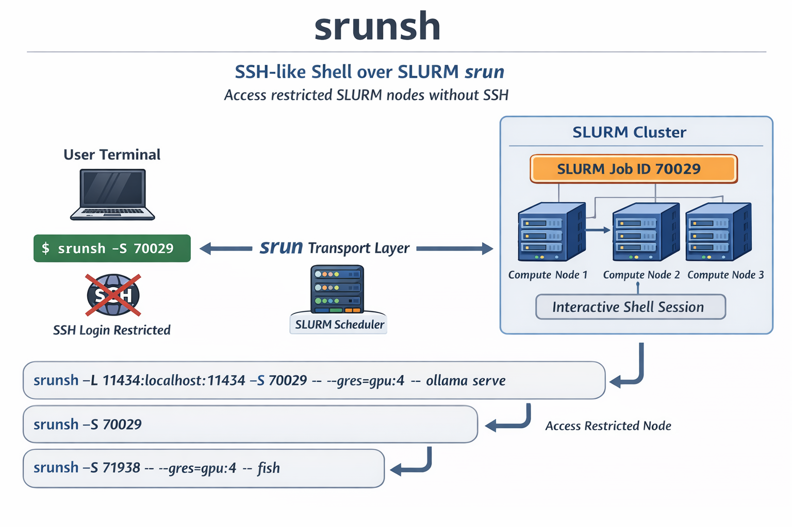

# srunsh

SSH-like shell over SLURM srun for SLURM nodes that have restricted or broken login shell.



When the SLURM job is allocated, it is usually allowed to login to the corresponding compute nodes via SSH, e.g. `ssh compute01`.
Obviously, such feature is highly desirable to unify local and cluster experiences, run interactive scripts, etc.

But the interactive shell to the node can be restricted for security reasons. In this case, srunsh comes at hand: it muxes your
interactive shell sessions via srun. Basically, srun is used as a "transport layer", instead of SSH.


## Examples

The main idea is to put the SLURM job id following the `-S` option, instead of using ssh node hostname or address:

```
srunsh -L 11434:localhost:11434 -S 70029 -- --gres=gpu:4 -- ollama serve

# new shell, same GPUs
srunsh -S 70029

# choose shell program manually
srunsh -S 71938 -- --gres=gpu:4 -- fish
```


## Usage

```
srunsh [options] [-- [srun_opts...] [-- command...]]

Options:
  -L lport:host:rport   Local port forwarding (repeatable)
  -S jobid              Attach to existing SLURM job
  -h, --help            Show this help

First invocation with -S becomes the ControlMaster (launches srun).
Subsequent invocations reuse the same connection automatically.
```
